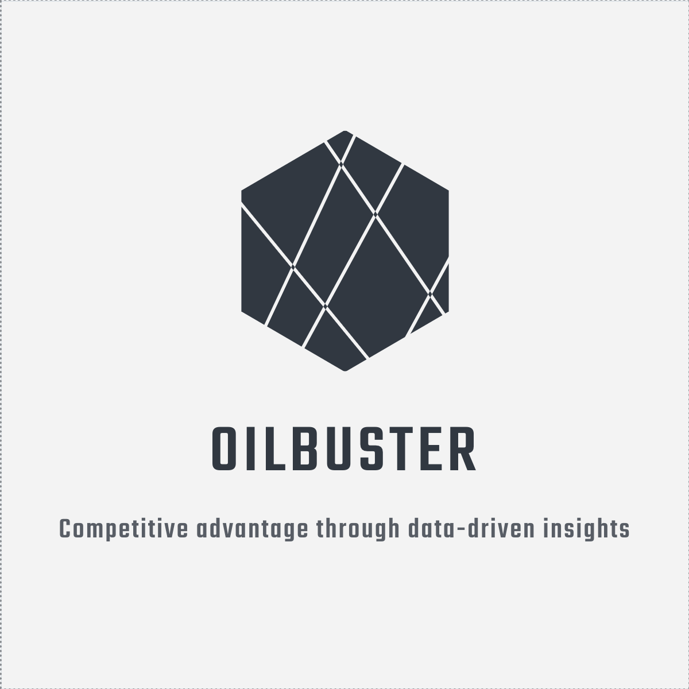
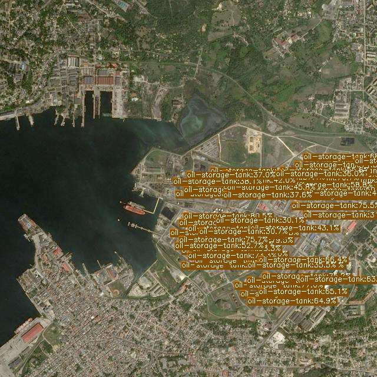

<br/>
<p align="center">
  <a href="https://github.com/felixbehne/ReadME-Generator">
    
  </a>

  <h3 align="center">Oil Storage Detection</h3>

  <p align="center">
    Kedro based computer vision pipeline for detection pol storage areas on satellite imagery. 
    <br/>
    <br/>
    <a href="https://github.com/felixbehne/ReadME-Generator"><strong>Explore the docs »</strong></a>
    <br/>
    <br/>
    <a href="https://github.com/felixbehne/ReadME-Generator/issues">Report Bug</a>
    .
    <a href="https://github.com/felixbehne/ReadME-Generator/issues">Request Feature</a>
  </p>
</p>

    

## Table Of Contents

* [About the Project](#about-the-project)
* [Built With](#built-with)
* [Getting Started](#getting-started)
  * [Prerequisites](#prerequisites)
  * [Installation](#installation)
* [Usage](#usage)
* [Roadmap](#roadmap)
* [Contributing](#contributing)
* [License](#license)
* [Authors](#authors)
* [Acknowledgements](#acknowledgements)

## About The Project



Aboveground Petroleum, Oil and Lubricant (POL) storage areas are common in manufacturing and government facilities. They fall under critical infrastructure for transportation (e.g. vehicles, ships and aircraft) and manufacturing industries (e.g. refineries, power stations, manufacturing). 
 
Deep Learning can automatically detect the number, size, and type of POL storage present on a site. This can help monitor the state of aboveground fuel storage tanks, including preventing spills, overfills, and corrosion.

The following business use cases can be identified: 

* Detect POL storage area to subsequently monitor the site for safety or environmental issues (e.g. fire hazard)
* Countries try to keep their oil reserves and production a secret. However, oil prices have a significant influence on the prices of all commodities. POL storage area detection would allow higher transparency leading to a potential competitive advantage. 

There are different companies that already target these business cases: 
* [Planet](https://www.planet.com)
* [Orbitalinsights](https://www.oribitalinsights.com)

## Built With

This project is based on the following core technologies: 

* [Kedro](https://kedro.readthedocs.io/en/stable/)
* [Tensorflow](https://www.tensorflow.org/)

## Getting Started

This is an example of how you may give instructions on setting up your project locally.
To get a local copy up and running follow these simple example steps.

### Prerequisites

For the project to work locally, the following libraries and frameworks are required: 

* [Python](https://www.python.org/)

### Installation

1. Clone the repo 
```sh 
git clone https://github.com/FelixBehne/oil-storage-detection.git
```
2. Install prerequisites
```sh
pip install -r src/requirements.txt
```
3. Run default pipeline 
```sh
kedro run
```


## Contributing

Contributions are what make the open source community such an amazing place to be learn, inspire, and create. Any contributions you make are **greatly appreciated**.
* If you have suggestions for adding or removing projects, feel free to [open an issue](https://github.com/felixbehne/oil-storage-detection/issues/new) to discuss it, or directly create a pull request after you edit the *README.md* file with necessary changes.
* Please make sure you check your spelling and grammar.
* Create individual PR for each suggestion.
* Don't remove any lines from the `.gitignore` file we provide
* Make sure your results can be reproduced by following a [data engineering convention](https://kedro.readthedocs.io/en/stable/faq/faq.html#what-is-data-engineering-convention)
* Don't commit data to your repository
* Don't commit any credentials or your local configuration to your repository. Keep all your credentials and local configuration in `conf/local/`

## License

Distributed under the MIT License. See [LICENSE](https://github.com/felixbehne/oil-storage-detection/blob/main/LICENSE.md) for more information.

## Authors

* [Felix Behne](https://github.com/felixbehne/) 
* [Frederik Dammeier](https://github.com/frederikdammeier/) 

## Acknowledgements

* [ImgShields](https://shields.io/)
